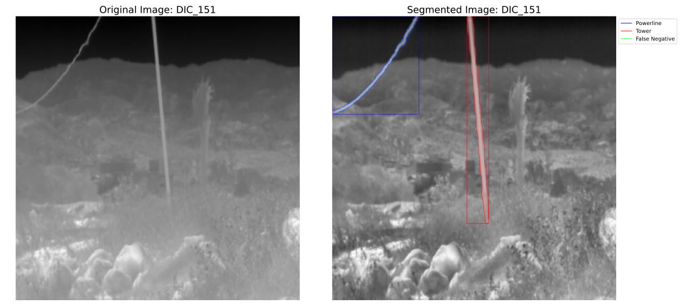

# AFAS-YOLOv8

 
Welcome to the official repository for "Addressing False Alarms from High-Voltage Structures in Subpixel Fire Detection" (currently under review). This repository contains all the necessary resources to replicate the experiments presented in our study.

 
Note that you will need to <a href="https://docs.ultralytics.com/modes/train/" target="_blank">perform training</a> using a pre-trained YOLOv8 model to run this code effectively.

## 📂 Dataset Access and Usage

 This study utilizes three open-access image datasets for research purposes: the FLIR ADAS, TarDAL $M{^3}FD$, and Powerline Image Dataset (PID). 
To replicate the results of this project, please download these datasets and merge them with our provided images and labels. 
Links for downloading the datasets are included in the paper. Each image annotation retains its original naming convention, 
with an additional identifier appended to ensure consistency. 

### Terms and Conditions
* FLIR ADAS Dataset: Please refer to the <a href="https://www.flir.com/oem/adas/adas-dataset-agree/" target="_blank">FLIR ADAS Terms of Use</a> for conditions on using FLIR ADAS data.
* Powerline Image Dataset (PID): The <a href="https://data.mendeley.com/datasets/n6wrv4ry6v/8" target="_blank">terms for using the Powerline Image Dataset</a> apply.
* TarDAL ($M{^3}FD$) Dataset: Usage of the $M{^3}FD$ dataset is subject to the <a href="https://github.com/JinyuanLiu-CV/TarDAL" target="_blank">TarDAL terms</a>.
* DIC Dataset: The dataset captured by our team (images acronym: DIC) is available under the <a href="https://creativecommons.org/licenses/by-nc/4.0/" target="_blank">CC BY-NC 4.0 license terms</a>.

## 💻 Materials

 Our proposed dataset is available in the Mendeley data repository: <a href="https://data.mendeley.com/datasets/rng8d63pk3/1" target="_blank">AFAS-YOLOv8</a>. 
Before running the provided examples, ensure that the "original_data" folder is included within this repository. Most of the data is stored in 16-bit format. 
To prepare it for training, please use the "normalize" method in <code>utils.py</code> to convert the data to an 8-bit format. 

 

 We have uploaded all images and labels for the DIC dataset, while only the labels for the other open-access datasets are included. 
To obtain the respective images for these datasets, please refer to the original download links. 

## 🔧 Dependencies and Installation 
* Python == 3.10.8
* opencv-python-headless == 4.8.1.78
* numpy == 1.26.1
* matplotlib == 3.7.2
* ultralytics == 8.0.213
  
## 🚀 Code Overview

The augmentation process carried out in this work was possible using <a href="https://docs.roboflow.com/datasets/image-augmentation" target="_blank">Roboflow augmentation tool</a>. Please, refer to its documentation to replicate the augmented dataset of the paper.

The methods developed for this project are organized in the code folder. Here’s a summary of key files:

* utils.py: This script includes essential utility methods, such as the Intersection over Union (IoU) calculation and preprocessing routines.
* segment_example.py: This example script demonstrates image segmentation. In the resulting segmentation, the color coding is as follows:
    * Red: Towers
    * Blue: Powerlines
    * Green: False Negatives

     

##  BibTeX
<!-- @InProceedings{aa,
    author    = {aa},
    title     = {aa},
    date      = {2024}
} -->

## 📜 License
This project is released under the AGPL-3.0 license.

## 📧 Contact
If you have any questions, please email antonio.galvan@ulpgc.es.
